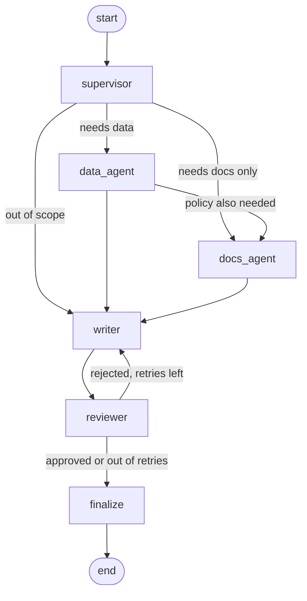

# Multi-Agent Ops Assistant

A multi-agent assistant built with LangGraph that answers internal operations questions by combining two sources: a SQL database of customers, orders and support tickets, and a set of internal policy documents. A supervisor decides which specialist agents a question needs, the specialists use tool calling to query the database and search the documents, and a reviewer checks every answer against what was actually retrieved before it is returned.

Example: *"What is the first response target for Helios Energy's open high priority tickets?"* can't be answered from either source alone. The data agent looks up the customer's tier and open tickets in the database, and the docs agent uses that tier to find the right line in the support SLA.

```
$ ops-agents ask "What is the first response target for Helios Energy's open high priority tickets?" -v

Customer record for Helios Energy GmbH: name Helios Energy GmbH, tier Enterprise, country Germany [Q1].
Open tickets for Helios Energy GmbH with high priority: id 105, priority high, status open, opened at 2026-01-22, subject Question about volume discount [Q2].
For Enterprise customers, the first response target is 1 hour for high priority tickets, 4 hours for medium priority tickets and 1 business day for low priority tickets. [D1]

status: approved

trace:
  supervisor: plan=['data_agent', 'docs_agent'] (mentions customer Helios Energy GmbH; asks about a policy or process)
  data_agent: 2 successful queries
  docs_agent: 1 search(es), 4 passages
  writer: draft 1
  reviewer: approved
  finalize: approved
```

## How it works



**Supervisor.** Uses structured output (a Pydantic `RoutePlan`) to decide whether the question needs the database, the documents, both, or neither. When both are needed, the data agent runs first so the docs agent can use what it found, for example the customer's tier. If the routing call fails, the supervisor falls back to a rule-based router instead of failing the request.

**Data agent.** A tool-calling agent with two tools, `describe_database` and `run_sql`. Every query goes through a read-only guard: single `SELECT` statements only, write and admin keywords rejected, a row limit added, and the SQLite connection itself opened in read-only mode. Errors are returned to the model as tool messages rather than raised, so the agent can read the error and fix its query.

**Docs agent.** A tool-calling agent with a `search_docs` tool over the internal documents. Documents are chunked by paragraph and indexed together with their title and section heading, so each passage keeps its context and every citation points to a specific section.

**Writer.** Drafts the answer using only the retrieved findings and cites each claim as `[Q1]` (query result) or `[D1]` (document passage).

**Reviewer.** Runs deterministic grounding checks on every draft: every citation must refer to something that was actually retrieved, a draft built from findings must cite them, and every number in the answer must appear in the findings. A rejected draft goes back to the writer with the reviewer's feedback. If it still fails after the retry limit, it is returned with status `needs_human_review` instead of being passed off as correct.

Each specialist is its own compiled LangGraph subgraph (model node ↔ tools node), and the main graph uses a checkpointer so follow-up questions in the same thread keep the conversation history.

## Running with or without an API key

The same graph runs in two modes:

| | LLM mode | Offline mode |
|---|---|---|
| Enabled by | `ANTHROPIC_API_KEY` or `OPENAI_API_KEY` | no key set |
| Routing | structured output from the model | keyword rules |
| SQL | written by the model, with retries on errors | templates for common question types |
| Doc search | the model picks search queries, can search several times | one search, enriched with tier and priority from the data agent |
| Answer | written by the model with citations | extractive, built from retrieved sentences and rows |

Offline mode exists so the project, tests and eval run anywhere without credentials. It only covers the question patterns it has rules for. LLM mode is the real use case.

## Tracing with Langfuse

Set `LANGFUSE_PUBLIC_KEY` and `LANGFUSE_SECRET_KEY` in `.env` and every run is sent to Langfuse as one trace, with spans for each graph node, model call and tool call, grouped into sessions by thread ID. With no keys set, tracing is off and nothing extra is imported. Each result also carries a plain `trace` list (shown with `-v`), which is handy for debugging offline.

## Setup

Requires Python 3.10+.

```bash
python -m venv .venv
source .venv/bin/activate
pip install -e ".[dev]"

cp .env.example .env          # optional: add an API key and Langfuse keys
python scripts/build_database.py
```

## Usage

```bash
# one question (-v shows the trace and the SQL that ran)
ops-agents ask "Who are our top 3 customers by revenue in 2025?" -v

# multi-turn session, conversation kept in the same thread
ops-agents chat

# print the compiled graph as Mermaid
ops-agents graph

# tests and evaluation
pytest -q
python evals/run_eval.py
```

## Evaluation

`evals/cases.jsonl` holds 24 questions: 5 that need both agents, 8 database-only, 10 document-only and 1 out of scope. Answers are scored against the data itself, not against fixed strings: each case can carry a reference SQL query, and every value it returns has to appear in the answer.

| Metric | What it checks |
|---|---|
| Routing accuracy | the supervisor picked exactly the expected agents |
| Doc recall | an expected document is among the retrieved passages |
| Answer correct | expected phrases and all reference SQL values appear in the answer |
| Passed grounding review | the reviewer approved the answer |

Results in offline mode (`evals/results.md`):

| Metric | Result |
|---|---|
| Routing accuracy | 23/24 (96%) |
| Doc recall | 14/15 (93%) |
| Answer correct | 22/24 (92%) |
| Passed grounding review | 24/24 (100%) |

The two misses are useful to look at:

- *"How fast do we have to respond to a medium priority ticket from Lumen Print Studio?"* The keyword router doesn't recognize "respond" as a policy question, so it only sends the question to the data agent and the SLA is never looked up. A model-based router doesn't have this problem, which is the main reason routing uses an LLM when one is available.
- *"What are the shipping costs for an order of 180 EUR?"* The docs agent finds the right section, but the extractive writer picks only the "free above 250 EUR" sentence and drops the 9.90 EUR flat fee in the next sentence. The answer isn't wrong, but it's incomplete. The grounding check passes because nothing in it is made up, which shows grounding and correctness are different things and both need measuring.

The test suite (`pytest`, 21 tests) covers the SQL guard, retrieval, the reviewer, the full graph in offline mode, and LLM mode using a scripted chat model. The scripted run sends a broken SQL query, checks that the agent recovers, has the writer invent a number, and checks that the reviewer rejects it and the retry fixes it.

## Project structure

```
multi-agent-ops-assistant/
├── data/
│   └── docs/                  # internal policy documents (markdown)
├── scripts/
│   └── build_database.py      # builds data/ops.db from a fixed seed
├── src/ops_agents/
│   ├── graph.py               # main LangGraph workflow
│   ├── agents.py              # supervisor, specialists, writer, reviewer nodes
│   ├── state.py               # graph state
│   ├── tools.py               # LangChain tools: search_docs, describe_database, run_sql
│   ├── sql_tools.py           # read-only query guard and execution
│   ├── retrieval.py           # section-aware chunking and TF-IDF retrieval
│   ├── review.py              # grounding checks
│   ├── offline.py             # rule-based fallbacks for routing, SQL and answers
│   ├── llm.py                 # Anthropic / OpenAI / offline model selection
│   ├── tracing.py             # optional Langfuse callbacks
│   └── cli.py
├── evals/
│   ├── cases.jsonl
│   ├── run_eval.py
│   └── results.md
└── tests/
```

## Data

All data is synthetic. The six policy documents describe a fictional mid-sized B2B supplier. The database (16 customers across three tiers, 400 orders, 160 support tickets) is generated from a fixed random seed, so every run and every eval result can be reproduced.

## Limitations and next steps

- Retrieval is TF-IDF, which works for a small, keyword-heavy corpus but will miss paraphrases on a larger one. `Retriever.search` is the only interface the agents use, so moving to embeddings and a vector store is a contained change.
- The eval set is small and written against the same corpus. It catches regressions but doesn't prove the system generalizes.
- The reviewer checks grounding, not completeness, as the shipping cost example shows. An LLM-as-judge completeness check, scored in Langfuse, would be the next addition.
- Specialists run one after the other. Independent lookups could run in parallel using LangGraph's `Send` API.
- `needs_human_review` answers are returned but not queued anywhere. A natural next step is to pause the graph with `interrupt` and let a reviewer approve or edit the answer before it's sent.

## License

MIT
